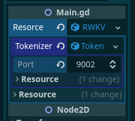

Unzip/git clone, into the ./modules/ folder of godot 4 repository.

Currently only works for linux, but it should be possible for it to work for windows

When running the created executable, you will need to have rwkvstic python package and its dependencies installed

The tokenizer is handled by running the tokenizerServer.py file(this is minimalistic, requiring only the transformers library `pip install transformers`, and the 20B_tokenizer.json file).

you will need to set the tokenizer port in the properties menu.

